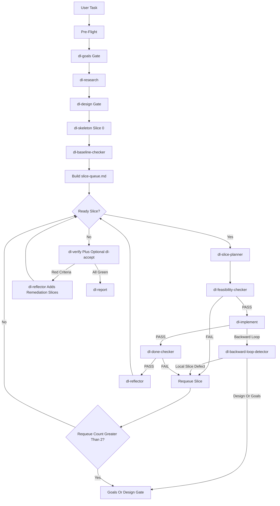

# DEEPLOOPER Pipeline

DEEPLOOPER is a continuous vertical-slice pipeline for complex software work. It keeps the proven front end from deepwork (Goals, Research, Design, Skeleton+Structure) but replaces the upfront Plan -> Implement -> Replan middle with a sequential slice loop: plan one slice just in time, prove its feasibility, implement it, check its done criteria, reflect lessons into the living spec, and then choose the next ready slice.

## Flow



## Route

DEEPLOOPER is full-route only. Targeted quick fixes should continue to use `deepwork`; this pipeline is for work where continuous slice validation is the main value.

## Human Gates

Only two points pause for human approval:

| Gate | Artifact | Purpose |
| --- | --- | --- |
| Goals | `goals.md` | Confirm intent, constraints, non-goals, and acceptance criteria. |
| Design | `design.md` | Confirm approach, vertical slices, and the Slice Dependency DAG. |

All later corrections are local slice requeues unless the controller or detector determines that Goals or Design must change.

## Run Directory

Each run writes to `.pipeline/deeplooper-<run-id>/` and preserves the directory as the audit trail.

```text
.pipeline/deeplooper-<run-id>/
├── state.md
├── config.md
├── requirements.md
├── goals.md
├── research/
│   └── summary.md
├── design.md
├── structure.md
├── skeleton-task.md
├── skeleton-results.md
├── baseline-results.md
├── slice-queue.md
├── lessons.md
├── spec-history.md
├── phases/
│   ├── phase-01/
│   │   ├── tasks/task-01.md
│   │   ├── slice-plan-summary.md
│   │   ├── feasibility-results.md
│   │   ├── execution-manifest.md
│   │   ├── e2e-regression-results.md
│   │   ├── integration-results.md
│   │   ├── regression-results.md
│   │   ├── stage7-summary.md
│   │   └── done-check-results.md
│   └── phase-NN/
├── reviews/
├── feedback/
├── stage9-summary.md
├── stage10-summary.md
└── telemetry/
    ├── events.jsonl
    ├── run-log.md
    └── metrics-summary.md
```

## State Files

### `state.md`

DEEPLOOPER owns this file and overwrites it after pre-flight, every stage boundary, every slice transition, every requeue/escalation decision, and resume recovery.

```yaml
---
run_id: deeplooper-YYYYMMDD-HHMMSS
route: full
last_completed_stage: goals
next_stage: research
current_slice: null
current_phase: 0
slices_done: []
slices_blocked: []
requeue_counts: {}
backward_loops: 0
interaction_mode: interactive
failure_policy: fail-closed
resume_source: fresh
---
```

Valid `next_stage` values are `goals`, `research`, `design`, `skeleton`, `baseline`, `slice-loop`, `verify`, `accept`, `report`, and `done`.

### `slice-queue.md`

`slice-queue.md` is the living plan. Each slice is one phase on disk.

```markdown
# Slice Queue

## Queue Invariants
- One active slice at a time.
- `phase_dir` values use `phases/phase-NN`.
- A slice is ready only when all `deps` have status `done`.
- `requeue_count > 2` escalates to the Design or Goals gate.

## Slices

### S-001 — Foundation Skeleton
- id: S-001
- title: Foundation Skeleton
- deps: []
- status: done
- requeue_count: 0
- last_reason: None.
- acceptance_criteria: [AC-001]
- phase_dir: phases/phase-01
- source: skeleton-results.md

### S-002 — Example Next Slice
- id: S-002
- title: Example Next Slice
- deps: [S-001]
- status: ready
- requeue_count: 0
- last_reason: None.
- acceptance_criteria: [AC-002]
- phase_dir: phases/phase-02
- source: design.md#vertical-slices
```

Statuses are `pending`, `ready`, `building`, `done`, `blocked`, or `escalated`.

### `lessons.md`

Per-run memory read by `dl-slice-planner` before every new or requeued slice.

```markdown
# Lessons

## Active Constraints
- [timestamp] [slice-id] Constraint or invariant discovered during implementation.

## Requeue Root Causes
- [timestamp] [slice-id] Reason and corrective planning instruction.

## Useful Patterns
- [timestamp] Pattern that should be reused by later slices.
```

### `spec-history.md`

Append-only log of living-spec amendments made by `dl-reflector`.

```markdown
# Spec History

## 2026-06-20T00:00:00Z — S-002
- Amendment type: clarify acceptance criterion | add constraint | narrow non-goal
- Source evidence: phase artifact or checker output
- Applied change: exact change made to `goals.md`
- Rationale: why this is a clarification rather than a scope expansion
```

## Slice Loop

For each ready slice, `deeplooper` dispatches:

1. `dl-slice-planner` writes `phases/phase-NN/tasks/task-01.md` with `## Feasibility Checklist`, `## Done Checklist`, and `## Slice Review Status`.
2. `dl-feasibility-checker` checks the feasibility section. Failure increments `requeue_count` and returns to the planner with the failing item.
3. `dl-implement` runs one-slice implementation using the phase directory task files.
4. `dl-done-checker` checks the done section against the built code and evidence. Failure requeues the slice.
5. `dl-reflector` marks the slice done, updates `lessons.md`, logs living-spec amendments in `spec-history.md`, and may add or unblock later slices.

## Requeue and Escalation

A local failure requeues only the current slice. Requeue preserves completed slice commits and all prior phase directories. If `requeue_count` becomes greater than 2, or if `dl-backward-loop-detector` classifies the issue as design/goals-level, `deeplooper` invokes the DEEPLOOPER backward-loop protocol. The only loop targets are Goals and Design.

## Global Gate

When no ready or pending slices remain, `dl-verify` runs the full verification gate over every `phases/phase-*` directory. `dl-accept` may also run as a global acceptance gate. Red acceptance criteria are converted by `dl-reflector` into remediation slices and the loop resumes. The run finishes only when the global gate is green, or when the only remaining red criteria belong to blocked/escalated slices and the final report records a PARTIAL result.

## Agent Namespace

The primary controller is `deeplooper`. All copied pipeline agents use `dl-*`; the original `qrspi-*` and `deepwork` files are not modified.
